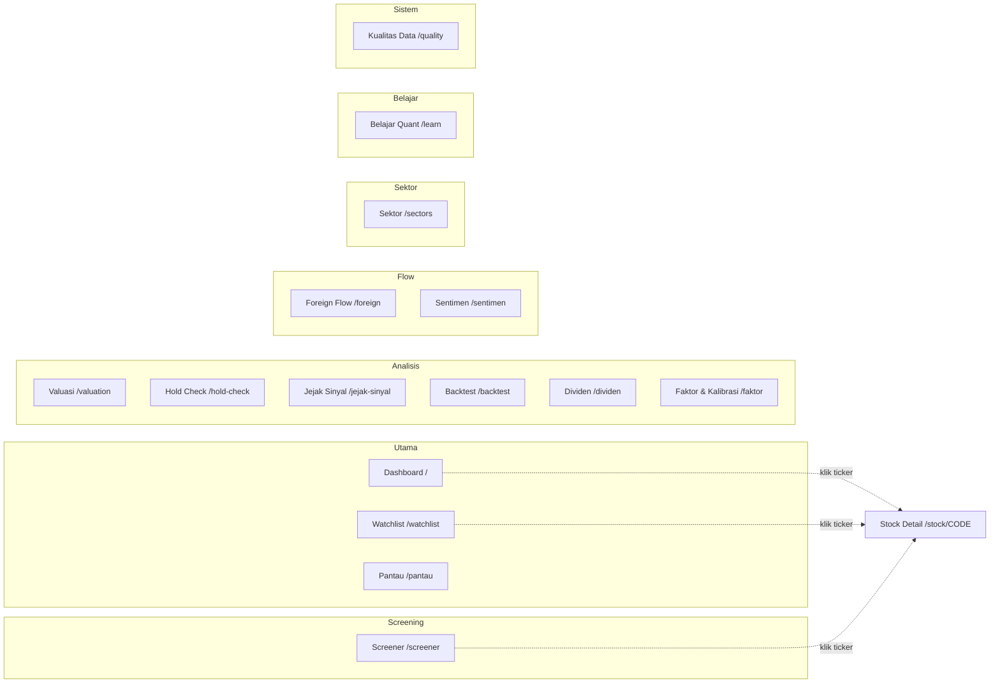
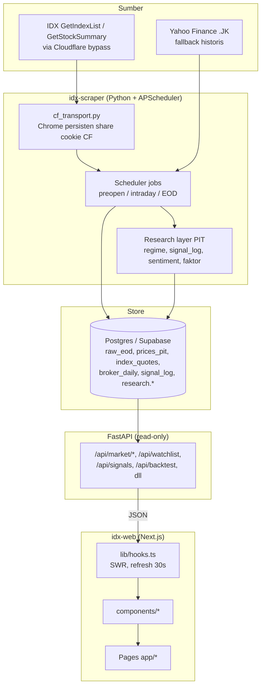

# Market Labs — IDX Web

Next.js + Recharts frontend for the IDX market-data platform. Presentation-only —
all calculations happen in the FastAPI backend
(`market-labs/idx-scraper/src/idx_scraper/api`). Data source auto-switches between
the official IDX feed and Yahoo Finance fallback.

## Peta Navigasi

Sidebar dibagi jadi 7 grup. Semua tabel emiten bisa di-klik untuk membuka
detail teknikal `/stock/[code]`.



## Menu & Fitur

### Grup: Utama

#### Dashboard (`/`)
Ringkasan pasar hari ini dalam satu layar:
- **Hero IHSG** — nilai Composite, perubahan poin & persen, volume/value/jumlah
  emiten aktif, plus waktu update terakhir.
- **Regime Banner + Timeline** — deteksi rezim IHSG (ADX + volatilitas realized:
  TRENDING/RANGING/TRANSISI) beserta riwayatnya.
- **Narasi Pasar** — ringkasan otomatis (IHSG + breadth naik/turun/flat).
- **Market Overview** — top gainers & losers.
- **Top Leaders** — leaderboard likuiditas per metrik (volume / value / frekuensi);
  realtime saat jam bursa, EOD di luar jam.
- **Top Brokers** — broker teraktif hari ini.
- **Signals Panel** — sinyal teknikal BUY/SELL/HOLD; klik emiten → chart di bawah.
- **Technical Chart** — kanvas detail bersama (dipilih dari panel mana pun).

#### Watchlist (`/watchlist`)
Daftar pantau manual — tambah/hapus emiten sendiri (persisted ke `.env` backend),
auto-refresh 30 detik. Klik baris → technical chart emiten itu.

#### Pantau (`/pantau`)
Watchlist + notifikasi dalam satu alur "pilih saham → pasang batas → tunggu Telegram":
- **Alert Rules CRUD** — pasang batas harga / RSI / volume per emiten.
- **Telegram Status** — cek koneksi + kirim pesan tes.
- Aturan diperiksa tiap data EOD baru masuk; notifikasi dikirim **sekali per
  persilangan** (anti-spam) dan reset setelah kondisi kembali normal.

### Grup: Screening

#### Screener (`/screener`)
Filter multi-kriteria: sinyal, RSI, momentum, value, foreign-in, rasio volume.
Hasil bisa di-klik ke detail emiten.

### Grup: Analisis

#### Valuasi (`/valuation`)
PER/PBV per emiten beserta peers pembanding.

#### Hold Check (`/hold-check`)
Verdikt gabungan teknikal + valuasi: "saham ini masih layak dipegang?"

#### Jejak Sinyal (`/jejak-sinyal`)
Track record kualitas sinyal:
- Hit rate, mean/median forward return, abnormal return vs pasar, dan MFE/MAE per
  horizon (5 / 10 / 21 hari bursa).
- Breakdown per rezim IHSG (trending / ranging / transisi).
- Daftar sinyal terbaru dengan return yang sudah terealisasi.

#### Backtest (`/backtest`)
Simulator strategi point-in-time: equity curve + metrik, cost model (komisi, pajak,
slippage), frekuensi rebalance yang bisa diatur, dan perbandingan gross/net vs
buy & hold. Backend tidak menyimpan apa pun → aman dijalankan berulang saat tuning.

#### Dividen (`/dividen`)
Overview dividen (total, riwayat tahunan, top trailing yield) + ledger corporate
action (split, reverse split, bonus, rights, dividen).

#### Faktor & Kalibrasi (`/faktor`)
Registry faktor kuantitatif (momentum, volatilitas, likuiditas Amihud, foreign net,
ketimpangan order book, absorption, dll) dengan definisi & kalibrasinya.

### Grup: Flow

#### Foreign Flow (`/foreign`)
Arus dana asing (net buy/sell) peringkat pasar.

#### Sentimen (`/sentimen`)
- **Gauge sentimen pasar** (0–100: risk-on / netral / risk-off) — breadth harga +
  IHSG + porsi emiten dibeli asing.
- **Daftar akumulasi & distribusi** — arus asing + ketimpangan buku intraday
  (bid/offer) & absorption, lengkap dengan alasan per emiten. Dihitung dari data
  tersimpan, bukan berita.

### Grup: Sektor

#### Sektor (`/sectors`)
Analisis sektor + **RRG** (Relative Rotation Graph) untuk melihat rotasi
kepemimpinan sektor.

### Grup: Belajar

#### Belajar Quant (`/learn`)
Halaman edukasi / glosarium istilah pasar & kuantitatif.

### Grup: Sistem

#### Kualitas Data (`/quality`)
Dashboard mutu layer `research.*`:
- Overview coverage, freshness, jumlah baris.
- Quarantine viewer (baris yang ditolak quality gate + alasannya).
- Coverage gaps & thin days (deteksi hari scrape hilang/parsial).
- Deteksi duplikat (bar dengan lebih dari satu knowledge_date).

### Detail Emiten (`/stock/[code]`)
Dibuka dengan klik ticker mana pun. Berisi price history, technical chart (OHLCV +
MA/BB/RSI/MACD), broker summary per emiten, dan detail dividen (riwayat cash + split).

## Alur Data

Frontend murni presentasi. Semua kalkulasi berat ada di backend; Postgres jadi satu-
satunya sumber kebenaran; UI hanya fetch JSON lewat SWR dan render.



Tahapannya:

1. **Sumber** — Angka utama dari **IDX** (`GetIndexList` untuk IHSG, `GetStockSummary`
   untuk EOD semua emiten). **Yahoo Finance** hanya fallback historis. Endpoint IDX
   diproteksi Cloudflare.
2. **Ingest (idx-scraper)** — `cf_transport.py` menjalankan Chrome persisten yang sudah
   lolos challenge Cloudflare, lalu menembak JSON IDX lewat `page.evaluate(fetch(...))`
   agar ikut memakai cookie yang bersih. **APScheduler** (timezone WIB) menjalankan job
   preopen / intraday / EOD. Setelah raw data masuk, **research layer point-in-time**
   menghitung regime IHSG, jejak sinyal, sentimen, dan faktor kuantitatif.
3. **Store (Postgres/Supabase)** — Semua ditulis idempotent (upsert `ON CONFLICT`).
   Tabel inti: `raw_eod` (source of truth), `prices_pit`, `index_quotes` (IHSG close
   resmi IDX-live), `broker_daily`, `signal_log`, plus schema `research.*`. Timezone
   di-set `Asia/Jakarta`.
4. **API (FastAPI read-only)** — Hanya membaca dari DB, **nol kalkulasi**. Expose
   endpoint `/api/*` lewat connection pool (autocommit sebelum `SET time zone`).
5. **Web (idx-web)** — `lib/hooks.ts` fetch JSON via **SWR** (auto-refresh 30 detik),
   diteruskan ke `components/*`, dirakit di halaman `app/*`. Frontend murni presentasi.

## Setup

```bash
cd d:/Project/market-labs/idx-web
npm install
```

Configure the backend URL in `.env.local`:

```env
NEXT_PUBLIC_API_BASE_URL=http://localhost:8000
```

## Run

Start the backend first (from `idx-scraper`, with Postgres env loaded):

```bash
cd /d/Project/market-labs/idx-scraper
set -a && . ./.env && set +a
.venv/Scripts/python.exe -m uvicorn idx_scraper.api.app:app --port 8000
```

Then the frontend:

```bash
cd /d/Project/market-labs/idx-web
npm run dev        # http://localhost:3000
```

If you serve on a different port (e.g. 3100), add it to the backend's
`IDX_API_CORS_ORIGINS` allowlist.

## Structure

- `lib/types.ts` — TypeScript mirrors of the backend Pydantic schemas
- `lib/api.ts` — typed fetch client + SWR fetcher
- `lib/hooks.ts` — SWR hooks (30s auto-refresh)
- `lib/format.ts` — id-ID number / percent / compact-IDR formatting
- `components/` — MarketOverview, MarketNarration, RegimeBanner, RegimeTimeline, MarketBadge, WatchlistTable, SignalsPanel, TopLeadersPanel, TopBrokersPanel, HoldCheckPanel, TechnicalChart, HistoryTable, SectorRRGChart, BrokerSummary, EquityCurveChart, RebalanceLedger, AlertRules, TelegramStatus, DividendYearChart, DividendDetailPanel, EventStudyCard, TickerLogo, Sidebar, Card, States, InfoHint, LastUpdated
- `app/page.tsx` — dashboard composition
- `app/watchlist/page.tsx` — daftar pantau manual + technical chart
- `app/pantau/page.tsx` — watchlist + signals + alert rules + Telegram wiring
- `app/stock/[code]/page.tsx` — per-stock technical, history, brokers, dividends
- `app/screener/page.tsx` — multi-criteria stock screener
- `app/sectors/page.tsx` — sector analysis + RRG rotation graph
- `app/foreign/page.tsx` — foreign fund flow
- `app/valuation/page.tsx` — PER/PBV valuation view
- `app/hold-check/page.tsx` — combined hold verdict
- `app/faktor/page.tsx` — registry faktor kuantitatif + kalibrasi
- `app/dividen/page.tsx` — dividend overview, trailing yields, corp-action ledger
- `app/quality/page.tsx` — data-quality dashboard (coverage, quarantine, gaps)
- `app/jejak-sinyal/page.tsx` — track record sinyal (per horizon & regime)
- `app/sentimen/page.tsx` — gauge sentimen pasar + daftar akumulasi/distribusi
- `app/backtest/page.tsx` — strategy simulator (equity curve, rebalance cadence, cost model, gross/net metrics vs buy & hold)
- `app/learn/page.tsx` — education / glossary page

Full change history for both repos: see `../idx-scraper/AUDIT.md`.
