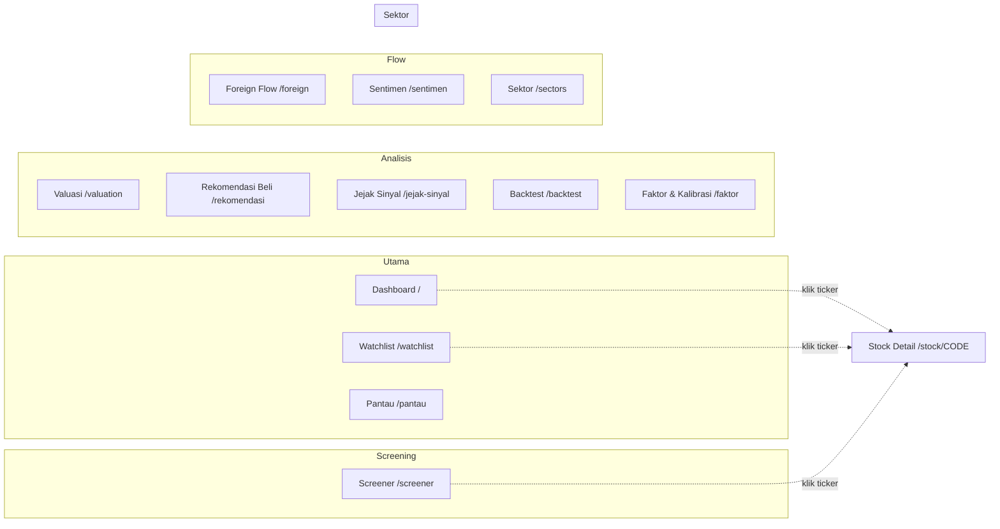
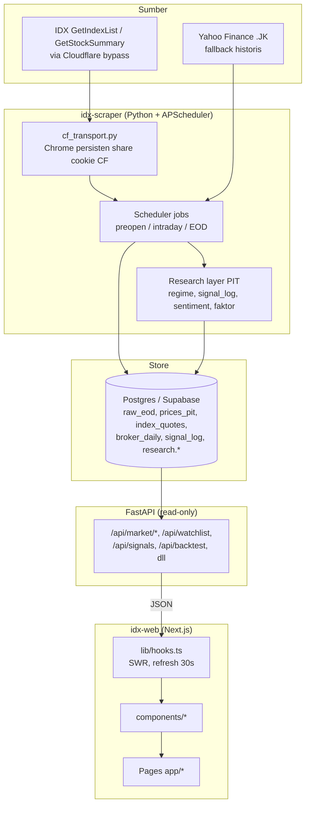

# IDX Web Frontend

**Next.js + Recharts** UI for the IDX market‑data platform. All heavy calculations live in the FastAPI backend (`idx‑scraper/src/idx_scraper/api`). The frontend auto‑switches between the official IDX feed and a Yahoo Finance fallback.

---

## Quick Start

1. **Install dependencies**
```powershell
cd D:\Project\market-labs\idx-web
npm ci   # or `pnpm install` if you prefer pnpm
```
2. **Configure environment** – copy the example and adjust the backend URL if needed:
```dotenv
# .env.local (auto‑loaded by Next.js)
NEXT_PUBLIC_API_BASE_URL=http://localhost:8000
```
3. **Run the development server**
```powershell
npm run dev   # starts on http://localhost:3000
```
   The browser calls the backend directly at the URL in `NEXT_PUBLIC_API_BASE_URL`.
4. **Build for production**
```powershell
npm run build && npm start
```
   The build produces a static‑optimized bundle in `.next`.

---

## Menu & Features

The sidebar groups the application into seven logical sections. Below each route is a short description of the UI elements and the data it presents.

| Group | Route | Feature Summary |
|-------|-------|-----------------|
| **Utama** | `/` (Dashboard) | Hero panel with IHSG composite, market‑wide volume/value split (regular vs non‑regular), Regime Banner + Timeline, market narrative, top gainers/losers, liquidity leaders, broker activity, signal panel, and an interactive technical chart.
| | `/watchlist` | Watch‑list view with real‑time price, volume, and smart‑money status per symbol. Includes a CRUD UI for alert rules (price, RSI, volume) and a Telegram status/debug panel.
| | `/pantau` | Consolidated monitoring of watch‑list alerts, smart‑money tracks, and Telegram connectivity. Alerts fire once per crossing and reset after the condition clears.
| **Screening** | `/screener` | Multi‑criteria filter (signals, RSI, momentum, value, foreign‑in, broker‑score). Results link to the detailed stock page. Broker‑score column appears only after IC validation.| **Analisis** | `/rekomendasi` | **Buy candidate board** — market‑wide ranked candidates with score/grade, entry zone, stop, target, R/R, position sizing, and a per‑grade track record. |
| | `/valuation` | PER / PBV per stock with peer comparison tables.
| | `/jejak-sinyal` | Signal performance dashboard – hit‐rate, forward returns, abnormal returns, MFE/MAE per horizon (5/10/21 days) and regime breakdown.
| | `/backtest` | Point‑in‑time back‑test simulator with equity curve, transaction‑cost model (commission, tax, slippage), rebalance frequency, and comparison against buy‑and‑hold.
| | `/faktor` | Registry of quantitative factors (momentum, Amihud, foreign net, order‑book imbalance, etc.) with definitions and calibration metadata.
| **Flow** | `/radar` | Market‑wide smart‑money radar showing the strongest foreign‑money inflow/outflow stocks (net buy / net sell) by value, with selectable windows (2/5/10/21 sessions), streak badges, and liquidity floor filters. Clicking a tile opens `/radar/[code]` for full signal history and technical chart.
| | `/foreign` | Ranked list of foreign‑money net flows per stock.
| | `/sentimen` | Sentiment gauge (0‑100) derived from market breadth, IHSG direction, and foreign‑money proportion; plus ranked lists of accumulation/distribution with order‑book imbalance metrics.
| | `/broker-activity` | Broker activity dashboard – accumulation score per stock (IC‑weighted factor scores), statistical factor validation table (IC, t‑stat, direction), and market‑wide broker concentration metrics (CR1/CR3/CR5, HHI).
| **Sektor** | `/sectors` | Sector‑by‑sector overview (average returns, breadth, transaction value, foreign‑money flow) plus **Sector Rotation** based on broker‑score trends (median score, direction over 5/21 sessions, sparkline history).

All pages share a common layout: a responsive sidebar, a header with the current market time, and a content area that adapts to desktop and mobile breakpoints.

---

## Framework Frontend (konvensi nyata, bukan agen otonom)

Tidak ada "agen" otonom di repo ini — aturan di bawah ditegakkan lewat struktur
kode, satu gerbang CI, dan review manual. Yang benar-benar ada:

| Peran | Wujud nyata |
|-------|-------------|
| **Batas presentasi** | Frontend **presentation-only**: nol kalkulasi bisnis di web. Semua hitungan di backend FastAPI; UI hanya fetch JSON lewat SWR (`lib/hooks.ts`, auto-refresh 30 detik) lalu render. |
| **Design system** | Token di `app/globals.css` (`--accent`, `--bg`/`--bg-elev`/`--border`, `--up`/`--down`/`--warn`/`--muted`) + primitif bersama: `.card`/`.card-hover`, `.badge` (buy/sell/hold/warn/accent/pre), `.btn`/`.btn-ghost`/`.btn-primary`, `.nav-link`, `.data-table`, `.skeleton`, `.gradient-text`, `.fade-up`. |
| **Komponen bersama** | `Card`, `States` (`Skeleton`/`ErrorState`/`EmptyState`), `InfoHint`, `LastUpdated`, `RegimeBanner`, `Sidebar`/`Topbar`, `TickerLogo` — dipakai ulang lintas halaman; tipe mirror backend di `lib/types.ts`, klien fetch di `lib/api.ts`. |
| **Aksesibilitas** | Atribut `aria-label` / `aria-hidden` / `aria-current` / `aria-modal` / `role` dipakai di ±31 berkas (nav, dialog mobile, tombol ikon); warna & kontras dari token `globals.css`. |
| **Kualitas otomatis** | Satu gerbang CI (`.github/workflows/ci.yml`): `npm ci` → `tsc --noEmit` → `next build`. **Tidak ada unit/E2E test runner** di repo ini (tidak ada Vitest/Jest/Playwright di `package.json`). |
| **"No AI slop"** | Checklist review manual (bukan agen): hindari hero generik, ikon seragam, copy placeholder, dan komponen hasil salin tanpa adaptasi. |

### Evaluasi & kalibrasi (di backend, bukan agen frontend)

Peran "Trainer" (Evaluation / Feedback Loop / Calibration) **tidak ada sebagai
kode frontend**. Yang benar-benar mengukur kualitas keputusan ada di backend:
`research/signal_log.py` (track record sinyal), `research/recommendation_log.py`
(track record kandidat beli), dan track record pola `smart_money` — semuanya
mengukur outcome forward + abnormal vs pasar supaya klaim bisa dicek, bukan
dipercaya. (`signal_log` & `recommendation_log` mempersist ke tabel;
track record `smart_money` dihitung saat diminta.) Di sisi frontend, satu-satunya gerbang otomatis adalah `tsc` + `next build`.

---

## Running the Frontend
1. Ensure the **backend** (`idx‑scraper`) is running and reachable at the URL defined in `NEXT_PUBLIC_API_BASE_URL`.
2. In a terminal, start the dev server:
```powershell
npm run dev
```
3. Open <http://localhost:3000> in a browser. The app automatically polls the backend APIs according to the schedule defined in the backend (APScheduler).
4. For production, build and start:
```powershell
npm run build && npm start
```
   The built files are served by the built‑in Next.js server.

---

## Glossary
- **IHSG** – Composite index of all listed Indonesian stocks.
- **Regular market** – Trading during official IDX hours (09:00‑16:00 WIB).
- **Non‑regular market** – After‑hours or pre‑market data (Yahoo fallback).
- **Radar** – Visual board of strongest foreign‑money inflows/outflows.
- **Broker‑score** – Weighted aggregation of validated quantitative factors (IC‑filtered) plus broker‑level market concentration.
- **IC** – Information‑Coefficient, statistical measure of factor predictive power.

---

*Last updated: 2026‑10‑06*

Next.js + Recharts frontend for the IDX market-data platform. Presentation-only —
all calculations happen in the FastAPI backend
(`market-labs/idx-scraper/src/idx_scraper/api`). Data source auto-switches between
the official IDX feed and Yahoo Finance fallback.

## Peta Navigasi

Sidebar dibagi jadi 7 grup. Semua tabel emiten bisa di-klik untuk membuka
detail teknikal `/stock/[code]`.



## Menu & Fitur

### Grup: Utama

#### Dashboard (`/`)
Ringkasan pasar hari ini dalam satu layar:
- **Hero IHSG** — nilai Composite, perubahan poin & persen, volume/value/jumlah
  emiten aktif, plus waktu update terakhir.
- **Volume & Value Pasar** (di dalam grid hero yang sama, di bawah IHSG) —
  pemisahan **pasar reguler** vs **non-reguler** (tunai + negosiasi): value Rp,
  volume lot & transaksi, plus porsinya terhadap total pasar. Volume/Value hero
  jadi total pasar (reguler + non-reguler) supaya kotak reguler bukan duplikat.
  Angka final setelah pasar tutup (sumber `GetStockSummary` IDX, agregat
  `research.market_segment_daily`).
- **Regime Banner + Timeline** — deteksi rezim IHSG (ADX + volatilitas realized:
  TRENDING/RANGING/TRANSISI) beserta riwayatnya.
- **Narasi Pasar** — ringkasan otomatis (IHSG + breadth naik/turun/flat).
- **Market Overview** — top gainers & losers.
- **Top Leaders** — leaderboard likuiditas per metrik (volume / value / frekuensi);
  realtime saat jam bursa, EOD di luar jam.
- **Top Brokers** — broker teraktif hari ini.
- **Signals Panel** — sinyal teknikal BUY/SELL/HOLD; klik emiten → chart di bawah.
- **Technical Chart** — kanvas detail bersama (dipilih dari panel mana pun).

#### Pantau (`/pantau`)
Watchlist + notifikasi dalam satu alur "pilih saham → pasang batas → tunggu Telegram":
- **Jejak Smart Money — Watchlist** — kartu ringkas: kondisi sekarang tiap emiten
  watchlist (ditimbun / dibuang / seimbang) + hitungannya. Alert Telegram menyala
  otomatis begitu verdict salah satu emiten berubah (tanpa pasang aturan). Daftar
  = baseline, jadi kamu tahu titik awalnya.
- **Alert Rules CRUD** — pasang batas harga / RSI / volume per emiten.
- **Telegram Status** — cek koneksi + kirim pesan tes.
- Aturan diperiksa tiap data EOD baru masuk; notifikasi dikirim **sekali per
  persilangan** (anti-spam) dan reset setelah kondisi kembali normal.

### Grup: Screening

#### Screener (`/screener`)
Filter multi-kriteria: sinyal, RSI, momentum, value, foreign-in, rasio volume,
serta **skor aktivitas broker** (`min_broker_score`, preset "Akumulasi Broker").
Hasil bisa di-klik ke detail emiten. Kolom & filter broker hanya terisi bila
skor sudah tervalidasi IC (lihat Aktivitas Broker) — sebelum itu kolomnya kosong
dan filter menyaring habis, bukan diam-diam diabaikan.

### Grup: Analisis

#### Rekomendasi Beli (`/rekomendasi`)
Papan kandidat beli se-pasar: tiap baris membawa **grade** (A/B/C), skor, **zona
entry**, **stop**, **target**, **R/R**, dan **ukuran posisi** (% modal dari
risiko 1% per posisi). Filter grade (A saja / B ke atas / semua) dan jumlah baris.
**Grade = peringkat relatif di dalam pool hari itu** (A 2% · B 10% · C 25%
teratas), bukan probabilitas dan bukan ambang skor absolut.

Di atasnya ada **strip lapisan** yang menyebut lapisan mana yang ikut
menggerakkan skor: komposisi skor datang dari walk-forward (semua komponen yang
lolos gate saat ini berbobot penalti), sementara **faktor IC** dan **aliran
broker** hanya aktif bila lolos gate IC — kalau belum, keduanya tidak ikut dan
halamannya bilang begitu, bukan menampilkan skor rekaan. Bukti **pola smart
money** ditampilkan sebagai alasan/peringatan per emiten, tapi belum menimbang
skor karena `foreign_net` baru tersedia ~50 sesi (di bawah jendela train).

Di bawah papan: **Track Record Kandidat** — seberapa sering kandidat benar-benar
berbuah, dipisah per grade dan horizon (5/10/21 hari), termasuk abnormal return
vs pasar. Ringkasnya diukur, bukan diklaim. Tiap kandidat bisa diklik ke Ruang
Keputusan atau detail teknikal.

> Alat bantu riset, bukan rekomendasi keuangan. Kandidat tanpa level stop yang
> bisa dihitung tidak ditampilkan.

#### Valuasi (`/valuation`)
PER/PBV per emiten beserta peers pembanding.

#### Jejak Sinyal (`/jejak-sinyal`)
Track record kualitas sinyal:
- Hit rate, mean/median forward return, abnormal return vs pasar, dan MFE/MAE per
  horizon (5 / 10 / 21 hari bursa).
- Breakdown per rezim IHSG (trending / ranging / transisi).
- Daftar sinyal terbaru dengan return yang sudah terealisasi.

#### Backtest (`/backtest`)
Simulator strategi point-in-time: equity curve + metrik, cost model (komisi, pajak,
slippage), frekuensi rebalance yang bisa diatur, dan perbandingan gross/net vs
buy & hold. Backend tidak menyimpan apa pun → aman dijalankan berulang saat tuning.

#### Faktor & Kalibrasi (`/faktor`)
Registry faktor kuantitatif (momentum, volatilitas, likuiditas Amihud, foreign net,
ketimpangan order book, absorption, dll) dengan definisi & kalibrasinya.

### Grup: Flow

#### Radar Smart Money (`/radar`)
Papan seluruh pasar: emiten dengan **jejak aliran dana asing terkuat** dalam dua
daftar — akumulasi (net buy) & distribusi (net sell) — diurutkan per **nilai
rupiah**, dengan pilih jendela 2/5/10/21 sesi, badge streak, dan lantai
likuiditas (nilai transaksi jendela ≥ Rp 500 jt). Klik emiten → `/radar/[code]`
(jejak lengkap: verdict, pola, level, konteks sektor) lalu detail teknikal.
Di bawahnya **Pola Terkuat Hari Ini** — papan pola klasik yang menyala di sesi
terakhir, dikelompokkan **per pola** dan diurutkan berdasar kekuatan bukti
(kesempatan pola ber-catatan terkuat, mis. inisiasi volume, untuk terlihat tanpa
menunggu ia kebetulan muncul di emiten yang sedang dibuka). Tiap kelompok
membawa rekam jejaknya (persentase sesuai arah, horizon terbaik, kata keyakinan)
dan emiten yang memicunya urut |net asing|, dengan catatan jujur berapa emiten
yang disaring lantai likuiditas.
Lalu **Pola Klasik — Track Record**: seberapa sering tiap pola berhasil di
120 sesi terakhir + alpha vs pasar, jadi klaim pola bisa dicek, bukan dipercaya
buta.

#### Foreign Flow (`/foreign`)
Arus dana asing (net buy/sell) peringkat pasar.

#### Sentimen (`/sentimen`)
- **Gauge sentimen pasar** (0–100: risk-on / netral / risk-off) — breadth harga +
  IHSG + porsi emiten dibeli asing.
- **Daftar akumulasi & distribusi** — arus asing + ketimpangan buku intraday
  (bid/offer) & absorption, lengkap dengan alasan per emiten. Dihitung dari data
  tersimpan, bukan berita.

#### Aktivitas Broker (`/broker-activity`)
Peringkat emiten berdasarkan **skor akumulasi** dari faktor aliran dana (proksi
jejak broker) + struktur broker pasar:
- **Peringkat skor akumulasi** — emiten dengan jejak aliran terkuat. Bobot tiap
  faktor berasal dari uji IC, dan hanya faktor yang lulus ambang (|IC| ≥ 0,05 &
  |ICIR| ≥ 0,5) yang diberi bobot; arahnya mengikuti tanda IC (ditentukan data,
  bukan asumsi). Kalau belum ada faktor yang lolos, halaman menampilkan status
  "belum tervalidasi" alih-alih skor rekaan.
- **Uji statistik faktor (IC)** — faktor mana yang layak dipakai, beserta bobot,
  t-stat, dan arah historisnya.
- **Struktur broker pasar** — konsentrasi transaksi per firma broker asli
  (CR1/CR3/CR5 + HHI), seluruh pasar, EOD.

Skor dari halaman ini dipakai ulang oleh Screener (filter `min_broker_score`),
skor keputusan backend (lapisan verdict), kartu detail emiten, dan **rotasi sektor** di
halaman Sektor — semuanya lewat satu snapshot yang sama, jadi angkanya tidak
pernah berbeda antar halaman.

> Catatan data: IDX tidak menyediakan breakdown broker **per saham** di endpoint
> gratis. Sisi per emiten karena itu memakai proksi (aliran asing bernotasi +
> ketimpangan buku intraday) dan dilabeli apa adanya; sisi struktur pasar memakai
> data firma broker asli (`research.broker_daily`).

### Grup: Sektor

#### Sektor (`/sectors`)
Analisis sektor per sektor (rata-rata %, breadth, nilai transaksi, arus asing),
plus **Rotasi Sektor — Aktivitas Broker**: rotasi dari **jejak aliran dana**
(median skor broker per sektor + arah perubahan 5/21 sesi, breadth, dan
sparkline riwayat) — sektor yang **alirannya** berbalik, meski harganya belum
bergerak.

### Detail Emiten (`/stock/[code]`)
Dibuka dengan klik ticker mana pun. Paling atas: banner **Jejak Smart Money**
(verdict hari ini + sejak kapan + ukurannya + pola + level). Tiap pola membawa
**rekam jejaknya** — badge "cerita N hari" (horizon tempat pola itu punya catatan
terbaik), persentase arah yang benar-benar sesuai pola, dan kata **keyakinan**
(tinggi/sedang/lemah); horizon selalu disebut karena tidak seragam antar pola,
dan pola diurutkan dari bukti terkuat. Verdict-nya juga diberi **konteks pasar**
(N dibuang vs M ditimbun di seluruh pasar) supaya bisa dibedakan "emiten ini
istimewa" dari "seluruh pasar sedang begitu". Lalu price history,
technical chart (OHLCV + MA/BB/RSI/MACD), broker summary per emiten, aktivitas
broker (skor aliran + riwayat driver + pembanding sektor), **Pemilik & Aksi
Pemilik** (komposisi pemegang saham dari keterbukaan IDX: free float publik,
pengendali, daftar pemilik terbesar, dan perubahan porsi vs snapshot
sebelumnya).

## Alur Data

Frontend murni presentasi. Semua kalkulasi berat ada di backend; Postgres jadi satu-
satunya sumber kebenaran; UI hanya fetch JSON lewat SWR dan render.



Tahapannya:

1. **Sumber** — Angka utama dari **IDX** (`GetIndexList` untuk IHSG, `GetStockSummary`
   untuk EOD semua emiten). **Yahoo Finance** hanya fallback historis. Endpoint IDX
   diproteksi Cloudflare.
2. **Ingest (idx-scraper)** — `cf_transport.py` menjalankan Chrome persisten yang sudah
   lolos challenge Cloudflare, lalu menembak JSON IDX lewat `page.evaluate(fetch(...))`
   agar ikut memakai cookie yang bersih. **APScheduler** (timezone WIB) menjalankan job
   preopen / intraday / EOD. Setelah raw data masuk, **research layer point-in-time**
   menghitung regime IHSG, jejak sinyal, sentimen, dan faktor kuantitatif.
3. **Store (Postgres/Supabase)** — Semua ditulis idempotent (upsert `ON CONFLICT`).
   Tabel inti: `raw_eod` (source of truth), `prices_pit`, `index_quotes` (IHSG close
   resmi IDX-live), `broker_daily`, `signal_log`, plus schema `research.*`. Timezone
   di-set `Asia/Jakarta`.
4. **API (FastAPI read-only)** — Hanya membaca dari DB, **nol kalkulasi**. Expose
   endpoint `/api/*` lewat connection pool (autocommit sebelum `SET time zone`).
5. **Web (idx-web)** — `lib/hooks.ts` fetch JSON via **SWR** (auto-refresh 30 detik),
   diteruskan ke `components/*`, dirakit di halaman `app/*`. Frontend murni presentasi.

## Setup

```bash
cd d:/Project/market-labs/idx-web
npm install
```

Configure the backend URL in `.env.local`:

```env
NEXT_PUBLIC_API_BASE_URL=http://localhost:8000
```

## Run

Start the backend first (from `idx-scraper`, with Postgres env loaded):

```bash
cd /d/Project/market-labs/idx-scraper
set -a && . ./.env && set +a
.venv/Scripts/python.exe -m uvicorn idx_scraper.api.app:app --port 8000
```

Then the frontend:

```bash
cd /d/Project/market-labs/idx-web
npm run dev        # http://localhost:3000
```

If you serve on a different port (e.g. 3100), add it to the backend's
`IDX_API_CORS_ORIGINS` allowlist.

## Structure

- `lib/types.ts` — TypeScript mirrors of the backend Pydantic schemas
- `lib/api.ts` — typed fetch client + SWR fetcher
- `lib/hooks.ts` — SWR hooks (30s auto-refresh)
- `lib/format.ts` — id-ID number / percent / compact-IDR formatting
- `components/` — MarketOverview, MarketNarration, RegimeBanner, MarketBadge, WatchlistTable, SignalsPanel, TopLeadersPanel, TopBrokersPanel, TechnicalChart, HistoryTable, SectorRotationTable, BrokerSummary, ForeignFlowCard, FlowTimelineCard, BrokerFlowCard, EquityCurveChart, RebalanceLedger, AlertRules, TelegramStatus, EventStudyCard, BrokerActivityCard, OwnershipCard, TickerLogo, Sidebar, Card, States, InfoHint, LastUpdated
- `app/page.tsx` — dashboard composition
- `app/radar/page.tsx` — Radar Smart Money (papan akumulasi/distribusi + track record pola)
- `app/radar/[code]/page.tsx` — jejak lengkap satu emiten (dari radar)
- `app/pantau/page.tsx` — watchlist + signals + alert rules + Telegram wiring
- `app/stock/[code]/page.tsx` — per-stock technical, history, brokers
- `app/screener/page.tsx` — multi-criteria stock screener
- `app/sectors/page.tsx` — sector analysis + rotasi aktivitas broker
- `app/foreign/page.tsx` — foreign fund flow
- `app/flow/page.tsx` + `app/flow/[code]/page.tsx` — aliran dana per emiten (arus asing, timeline skor, komposisi broker) dengan deep-link /flow/[code]
- `app/rekomendasi/page.tsx` — buy candidate board (grade, entry/stop/target, R/R, sizing, per-grade track record)
- `app/valuation/page.tsx` — PER/PBV valuation view
- `app/keputusan/page.tsx` + `app/keputusan/[code]/page.tsx` — Ruang Keputusan: verdict gabungan + regime + sentimen + jejak asing + level pembatalan + base rate event (deep-link /keputusan/[code])
- `app/faktor/page.tsx` — registry faktor kuantitatif + kalibrasi
- `app/jejak-sinyal/page.tsx` — track record sinyal (per horizon & regime)
- `app/sentimen/page.tsx` — gauge sentimen pasar + daftar akumulasi/distribusi
- `app/backtest/page.tsx` — strategy simulator (equity curve, rebalance cadence, cost model, gross/net metrics vs buy & hold)
- `app/broker-activity/page.tsx` — aktivitas broker (skor aliran tervalidasi IC + komposisi asing/lokal/BUMN + struktur broker pasar)

## Chat Commands

Perintah singkat buat nyuruh AI jalanin project ini. Tinggal copy-paste di chat:

| Perintah | Yang dijalankan |
|---|---|
| `jalanin web` | `npm run dev` (Next.js dev server, port 3000) |
| `jalanin web + backend` | jalankan `npm run dev` + `python -m idx_scraper.cli serve` di idx-scraper |

> **Note:** Frontend butuh backend jalan di `localhost:8000`. Kalau backend belum jalan, dashboard tetap load tapi data nggak muncul.

Full change history for both repos: see `../idx-scraper/AUDIT.md`.
