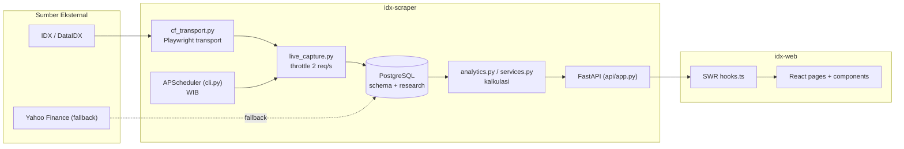
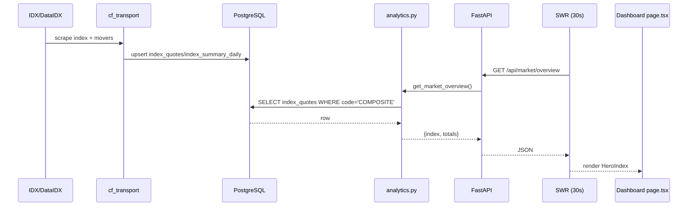
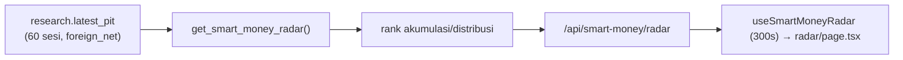
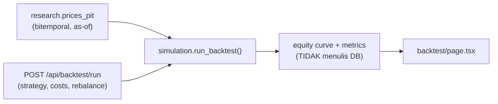
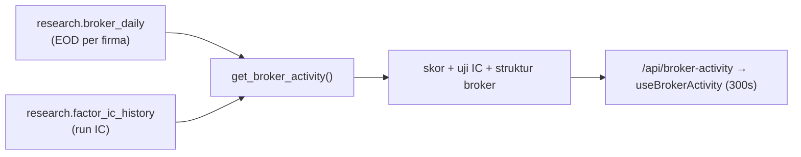
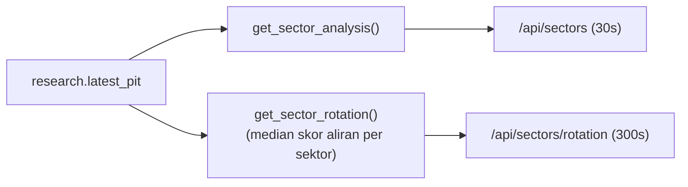
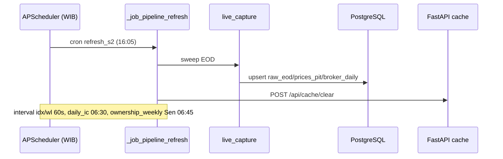

# Market Labs — Dokumentasi Menu

Dokumentasi teknis-fungsional per menu untuk aplikasi **Market Labs** (platform data pasar saham IDX). Sumber kebenaran daftar menu adalah [`components/Sidebar.tsx`](../../idx-web/components/Sidebar.tsx) (GROUPS, baris 33–70).

Dokumen ini dipakai oleh tiga audiens:

- **Developer baru** — onboarding: peta route, endpoint, tabel, dan job.
- **Analis / PM** — memahami fungsi tiap card dan dari mana angkanya.
- **Maintainer** — tahu kapan data dibuat, job mana yang mengisi, dan bagaimana memperbaruinya.

## Arsitektur Ringkas

- **`idx-web`** — Frontend Next.js (App Router) + Recharts + Tailwind. **Presentation-only**: nol kalkulasi bisnis. Semua data di-fetch sebagai JSON lewat SWR ([`lib/hooks.ts`](../../idx-web/lib/hooks.ts), interval default 30 detik). Tipe mirror di [`lib/types.ts`](../../idx-web/lib/types.ts), fetch client di [`lib/api.ts`](../../idx-web/lib/api.ts).
- **`idx-scraper`** — Backend Python/FastAPI + PostgreSQL + APScheduler (timezone WIB). Sumber kalkulasi & penyimpanan. API di [`src/idx_scraper/api/`](../../idx-scraper/src/idx_scraper/api/), scheduler di [`cli.py`](../../idx-scraper/src/idx_scraper/cli.py).
- Base URL backend: `NEXT_PUBLIC_API_BASE_URL` (default `http://localhost:8000`).
- **Chrome global** (dipasang di semua halaman): sidebar bisa diciutkan menjadi rail, tema terang/gelap, badge kesegaran data, dan command palette (Ctrl/Cmd+K). Rincian di bagian [Chrome Global](#chrome-global).



## Indeks Menu

| Group | Route | Menu | Fungsi (1 baris) | Card | Sumber data utama | Update |
|---|---|---|---|---|---|---|
| Utama | `/` | Dashboard | Ringkasan pasar: IHSG, regime, narasi, leaderboard, sinyal | 8 | `index_quotes`, `index_summary_daily`, `research.latest_pit` | on-demand + SWR 30s |
| Utama | `/pantau` | Pantau | Watchlist + alert + chart | 5 | `watchlist`, `stock_quotes` | on-demand + SWR 30s |
| Screening | `/screener` | Screener | Filter saham multi-kriteria | 3 | `research.latest_pit` | on-demand + SWR 30s |
| Analisis | `/rekomendasi` | Rekomendasi Beli | Papan kandidat + track record | 3 | `research.recommendation_log` | job harian `idx recommend` |
| Analisis | `/keputusan` | Ruang Keputusan | Verdict per emiten + event study | 5 | `research.latest_pit`, `signal_log` | on-demand (cache 1h) |
| Analisis | `/valuation` | Valuasi | Z-score band statistik undervalued/overvalued | 2 | `research.latest_pit` | on-demand + SWR 300s |
| Analisis | `/hold-check` | Hold Check | Skor 0–100 tahan/jual | 2 | `research.latest_pit` + `orderbook` | on-demand + SWR 300s |
| Analisis | `/jejak-sinyal` | Jejak Sinyal | Track record sinyal vs pasar | 4 | `research.signal_log` | job `idx signal-log` |
| Analisis | `/backtest` | Backtest | Simulasi point-in-time | 8 | `research.prices_pit` | on-demand (POST, tanpa tulis DB) |
| Analisis | `/faktor` | Faktor & Kalibrasi | Bobot IC, regime, registry faktor | 6 | `research.factor_ic_history`, `regime_daily` | job `idx ic` (harian 06:30) |
| Flow | `/radar` | Radar Smart Money | Akumulasi/distribusi asing | 6 | `research.latest_pit` | on-demand + SWR 300s |
| Flow | `/foreign` | Foreign Flow | Arus asing harian + top | 2 | `research.latest_pit` | on-demand + SWR 30s |
| Flow | `/flow` | Aliran Dana Emiten | Timeline aliran per emiten | 4 | `research.broker_daily` | on-demand + SWR 300s |
| Flow | `/sentimen` | Sentimen | Skor posisi dari jejak transaksi | 3 | `research.latest_pit` + `orderbook` | on-demand (cache 1h) |
| Flow | `/broker-activity` | Aktivitas Broker | Skor aliran + uji IC + struktur broker | 4 | `research.broker_daily`, `factor_ic_history` | on-demand + SWR 300s |
| Sektor | `/sectors` | Sektor | Rotasi sektor + peta kekuatan | 3 | `research.latest_pit` | on-demand + SWR 30s |

### Halaman Detail & Tambahan

| route | Tipe | Isi |
|---|---|---|
| `/stock/[code]` | Dinamis | Semua card analitik satu emiten (SmartMoneyBanner, chart, signals, ownership, foreign flow, event study, history) |
| `/keputusan/[code]` | Dinamis | Workspace keputusan per emiten (verdict, jejak asing, level pembatalan, base rate) |
| `/flow/[code]` | Dinamis | Workspace aliran dana per emiten (ForeignFlowCard, FlowTimelineCard, BrokerFlowCard) |
| `/radar/[code]` | Dinamis | SmartMoneyBanner + track record + back-link |
| (semua) `error` | Status | [`app/error.tsx`](../../idx-web/app/error.tsx): tampilan galat dengan tombol coba lagi dan `ThemeToggle` |
| (semua) `loading` | Status | [`app/loading.tsx`](../../idx-web/app/loading.tsx): skeleton saat route dimuat |
| (semua) `not-found` | Status | [`app/not-found.tsx`](../../idx-web/app/not-found.tsx): halaman 404 dengan tautan kembali |

> Route `/watchlist` tidak terdaftar di `Sidebar.tsx` — watchlist diakses via menu **Pantau**.

### Chrome Global

Komponen yang tampil di semua halaman, tidak termasuk dalam tabel menu di atas. Perilaku di bawah ini sudah dikonfirmasi terhadap UI yang berjalan di http://localhost:3000 (2026-10-11).

| Fitur | Implementasi | Perilaku | Penyimpanan lokal |
|---|---|---|---|
| Sidebar rail | [`components/Sidebar.tsx`](../../idx-web/components/Sidebar.tsx) (`SIDEBAR_KEY`, baris 73) | Sidebar bisa diciutkan menjadi rail ikon. Grup: Utama, Screening, Analisis, Flow, Sektor | `ml-sidebar-collapsed` (`1` = ciut) |
| Tema terang/gelap | [`components/ThemeToggle.tsx`](../../idx-web/components/ThemeToggle.tsx) (`KEY`, baris 8) | Default gelap. Skrip inline di [`app/layout.tsx`](../../idx-web/app/layout.tsx) (`THEME_SCRIPT`) menerapkan kelas sebelum render agar tidak ada kilatan (anti-FOUC) | `ml-theme` (`dark` / `light`) |
| Badge kesegaran data | [`components/GlobalLastUpdated.tsx`](../../idx-web/components/GlobalLastUpdated.tsx), dirender di Topbar lewat `Sidebar.tsx` (baris 172) | Menampilkan waktu data terakhir dari `useMarketOverview()` ([`lib/hooks.ts`](../../idx-web/lib/hooks.ts), baris 59) memakai komponen `LastUpdated`. Teks awal: "Memuat data..." | — |
| Command palette | [`components/CommandPalette.tsx`](../../idx-web/components/CommandPalette.tsx), dipasang di [`app/layout.tsx`](../../idx-web/app/layout.tsx) | Buka dengan Ctrl/Cmd+K, tutup dengan Esc. Berisi daftar menu (dengan kata kunci) dan pencarian emiten lewat `searchStocks()` → `GET /api/search` | — |

Sinkronisasi filter Screener: filter di [`app/screener/page.tsx`](../../idx-web/app/screener/page.tsx) ditulis ke query string URL (`useSearchParams` + `useRouter`), sehingga tautan hasil filter bisa dibagikan dan dibuka ulang.

Logo emiten dan broker: [`components/TickerLogo.tsx`](../../idx-web/components/TickerLogo.tsx) membaca `manifest.json` dari folder yang ditunjuk prop `basePath`, lalu memakai file lokal di folder tersebut. Bila file tidak ada, ditampilkan monogram kode.

- Emiten: `basePath="/logos"` (default), file `public/logos/{CODE}.png`, manifest [`public/logos/manifest.json`](../../idx-web/public/logos/manifest.json). Dataset: 912 logo, 51 monogram (dari 963 kode). Sumber TradingView. Dipakai di Top Leaders, Market Overview, Watchlist, Radar, Screener, Valuation, Foreign Flow, dan Smart Money.
- Broker: `basePath="/logos/brokers"`, file `public/logos/brokers/{CODE}.jpg`, manifest [`public/logos/brokers/manifest.json`](../../idx-web/public/logos/brokers/manifest.json). Dataset: 88 logo (dari 88 kode di `research.broker_daily`), tanpa fallback. Sumber `idx.co.id/StaticData/Brokers/Logo/{CODE}.jpg`, diambil lewat `scripts/fetch_broker_logos.py` (butuh Chrome; lihat README idx-scraper). Dipakai di panel Top Broker ([`components/TopBrokersPanel.tsx`](../../idx-web/components/TopBrokersPanel.tsx)).

Status hak cipta logo (emiten maupun broker) tetap `[BELUM TERVERIFIKASI]`. Kode broker `PC` disimpan sebagai `.bmp` (sumber mengembalikan BMP di balik URL `.jpg`) dan tetap tampil normal karena UI memakai field `file` dari manifest.

## Diagram Alur Data (Menu Kompleks)

### Dashboard


### Radar Smart Money


### Backtest


### Aktivitas Broker


### Sektor


### Sekuens Update Data


## Mapping Menu → Endpoint → Modul Backend → Tabel → Job

| Menu | Endpoint | Modul | Tabel | Job/Penjadwalan |
|---|---|---|---|---|
| Dashboard | `/api/market/overview` | `services.get_market_overview` | `index_quotes` | interval `idx` 60s |
| Dashboard | `/api/market/trade-summary` | `services.get_market_trade_summary` | `research.market_segment_daily` | EOD refresh |
| Dashboard | `/api/market/regime` | `analytics.get_market_regime` | `index_summary_daily`, `research.latest_pit` | on-demand |
| Dashboard | `/api/market/leaders` | `services.get_market_leaders` | `stock_summary_daily`/`stock_quotes` | interval `wl` 60s |
| Dashboard | `/api/market/top-brokers` | `services.get_top_brokers` | `research.broker_daily` | EOD refresh |
| Dashboard | `/api/signals` | `services.get_signals` | `research.latest_pit` | on-demand |
| Dashboard | `/api/stocks/{code}/technical` | `services.get_technical_chart` | `stock_daily`, `stock_quotes` | interval `wl` |
| Dashboard | `/api/market/narration` | `analytics.get_market_narration` | `research.latest_pit` | on-demand |
| Pantau | `/api/watchlist` (GET/POST/PUT/DELETE) | `services.get_watchlist` | `watchlist` | interval `wl` 60s |
| Pantau | `/api/alerts` (+ test) | `alerts` | alert store | interval `alerts` 300s (bila Telegram aktif) |
| Screener | `/api/screener` | `analytics.get_screener` | `research.latest_pit` | on-demand |
| Rekomendasi | `/api/recommendations` | `analytics.get_recommendations` | `research.recommendation_log` | job harian `idx recommend` |
| Rekomendasi | `/api/recommendations/track` | `analytics.get_recommendation_track` | `research.recommendation_log` | job harian |
| Rekomendasi | `/api/stocks/{code}/recommendation` | `analytics.get_stock_recommendation` | `research.recommendation_log` | on-demand |
| Ruang Keputusan | `/api/stocks/{code}/decision` | `analytics.get_stock_decision` | `research.latest_pit`, `signal_log` | on-demand (cache 1h) |
| Valuasi | `/api/valuation` | `analytics.get_valuation` | `research.latest_pit` | on-demand |
| Hold Check | `/api/hold-check` | `services.get_hold_check` | `research.latest_pit`, `orderbook` | on-demand |
| Jejak Sinyal | `/api/signals/track` | `analytics.get_signal_track` | `research.signal_log` | job `idx signal-log` |
| Backtest | `/api/backtest/config` + `/run` | `simulation` | `research.prices_pit` | on-demand (POST) |
| Faktor | `/api/factors/overview` | `analytics.get_factors_overview` | `research.factor_ic_history` | job harian `daily_ic` 06:30 |
| Faktor | `/api/market/regime/history` | `analytics.get_regime_history` | `research.regime_daily` | idempoten, backfill dari `index_summary_daily` |
| Radar | `/api/smart-money/radar` | `analytics.get_smart_money_radar` | `research.latest_pit` | on-demand |
| Radar | `/api/smart-money/track-record` | `analytics.get_smart_money_track_record` | `research.latest_pit` | on-demand |
| Radar | `/api/smart-money/patterns` | `analytics.get_smart_money_patterns_board` | `research.latest_pit` | on-demand |
| Radar | `/api/smart-money/verdicts` | `analytics.get_smart_money_verdicts` | `research.latest_pit` | on-demand |
| Radar | `/api/stocks/{code}/smart-money` | `analytics.get_stock_smart_money` | `research.latest_pit` | on-demand |
| Foreign Flow | `/api/foreign-flow` | `analytics.get_foreign_flow` | `research.latest_pit` | on-demand |
| Foreign Flow | `/api/stocks/{code}/foreign-flow` | `analytics.get_stock_foreign_flow` | `research.latest_pit` | on-demand |
| Aliran Dana | `/api/broker-flow` | `analytics.get_broker_flow` | `research.broker_daily` | EOD refresh |
| Aliran Dana | `/api/stocks/{code}/broker-activity` | `analytics.get_stock_broker_activity` | `research.broker_activity` | EOD refresh |
| Sentimen | `/api/sentiment` | `analytics.get_sentiment` | `research.latest_pit`, `orderbook` | on-demand |
| Aktivitas Broker | `/api/broker-activity` | `analytics.get_broker_activity` | `research.broker_daily` | EOD refresh |
| Aktivitas Broker | `/api/stocks/{code}/brokers` | `services.get_broker_concentration` | `research.broker_daily` | EOD refresh |
| Sektor | `/api/sectors` | `analytics.get_sector_analysis` | `research.latest_pit` | on-demand |
| Sektor | `/api/sectors/rotation` | `analytics.get_sector_rotation` | `research.latest_pit` | on-demand |
| (semua) | `/api/cache/clear` | `analytics.clear_research_cache` | — | dipanggil job refresh |
| Command Palette (semua) | `/api/search?q=&limit=` | `analytics.search_stocks` ([`analytics.py`](../../idx-scraper/src/idx_scraper/api/analytics.py) baris 1626) | `research.latest_pit` | on-demand, saat mengetik di palette |
| (semua) | `/health` | — | — | — |

## Penjadwalan (APScheduler, WIB)

Sumber: [`cli.py`](../../idx-scraper/src/idx_scraper/cli.py) `cmd_serve`. Semua job refresh memanggil `POST /api/cache/clear`.

| Job ID | Jadwal | Tugas |
|---|---|---|
| `idx` | interval, `IDX_INDEX_INTERVAL` (default 60s) | refresh index |
| `wl` | interval, `IDX_WATCHLIST_INTERVAL` (default 60s) | refresh watchlist |
| `alerts` | interval, `IDX_ALERT_INTERVAL` (default 300s) | evaluasi aturan alert (bila Telegram aktif) |
| `refresh_preopen` | Mon–Fri 08:45 | pra-buka (`do_eod=False`) |
| `refresh_s1` | Mon–Thu 12:00 | sesi 1 (EOD) |
| `refresh_s1_fri` | Fri 11:30 | sesi 1 Jumat (EOD) |
| `refresh_s2` | Mon–Fri 16:05 | sesi 2 / EOD |
| `refresh_s2_late` | Mon–Fri 16:20 | EOD susulan |
| `health_eod` | Mon–Fri 17:00 | cek kesehatan EOD |
| `refresh_weekend_am` | Sat–Sun 08:45 | refresh akhir pekan |
| `refresh_weekend_pm` | Sat–Sun 16:00 | refresh akhir pekan |
| `daily_ic` | Mon–Fri 06:30 | hitung IC faktor → `factor_ic_history` |
| `ownership_weekly` | interval 1 minggu, mulai Sen 06:45 | snapshot ownership |

> **Startup catchup**: saat serve mulai, backend mengecek `prices_pit` dan `index_quotes`; bila kosong/stale ia memicu refresh (lihat [`cli.py`](../../idx-scraper/src/idx_scraper/cli.py) sekitar baris 1180).

## Cara Menjalankan Backend (agar semua data update)

1. **Aktifkan Postgres.** Set `IDX_STORAGE=postgres` di `.env` (jangan commit isi `.env`).
2. **Jalankan serve** (launcher + child + scheduler):
   ```powershell
   cd d:\Project\market-labs\idx-scraper
   .\scripts\start-serve.bat
   ```
   Jangan jalankan proses `score_eval` lain secara paralel tanpa alasan.
3. **Cek health**: `curl http://localhost:8000/health` → 200.
4. **Pastikan transport Chrome** untuk data live: profile `IDX_CHROME_PROFILE_DIR` (mis. `p3`). Bila Chrome lain memegang profile → cf-transport gagal ("existing browser session"). Cooldown revive 600s membatasi pengulangan.
5. **Biarkan scheduler berjalan minimal satu siklus EOD** (`refresh_s2` 16:05 WIB) agar `raw_eod`/`prices_pit`/`broker_daily` terisi.
6. **Backfill manual** bila perlu: `idx eod <YYYYMMDD>`, `idx ic`, `idx signal-log`, `idx recommend`.

## Konvensi

- **Versi padat**: satu file per menu dengan struktur 7 bagian baku; detail identik tidak diulang antar menu.
- Rujukan `file:line` untuk endpoint, komponen, dan rumus.
- Item yang belum dapat diverifikasi dari kode ditandai `[BELUM TERVERIFIKASI]`.
- Tidak ada rahasia (kredensial/token/DSN) dalam dokumen; hanya nama variabel env.

## Daftar File

- [dashboard.md](./dashboard.md)
- [pantau.md](./pantau.md)
- [screener.md](./screener.md)
- [rekomendasi.md](./rekomendasi.md)
- [ruang-keputusan.md](./ruang-keputusan.md)
- [valuasi.md](./valuasi.md)
- [hold-check.md](./hold-check.md)
- [jejak-sinyal.md](./jejak-sinyal.md)
- [backtest.md](./backtest.md)
- [faktor.md](./faktor.md)
- [radar-smart-money.md](./radar-smart-money.md)
- [foreign-flow.md](./foreign-flow.md)
- [aliran-dana-emiten.md](./aliran-dana-emiten.md)
- [sentimen.md](./sentimen.md)
- [aktivitas-broker.md](./aktivitas-broker.md)
- [sektor.md](./sektor.md)
- [halaman-detail.md](./halaman-detail.md)

## Build PDF

```powershell
cd d:\Project\market-labs\idx-web\docs
& "d:\Project\market-labs\idx-scraper\.venv\Scripts\python.exe" build-pdf.py
```

Output: [`Market-Labs-Dokumentasi-Menu.pdf`](./Market-Labs-Dokumentasi-Menu.pdf)
